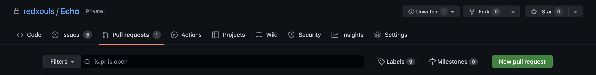
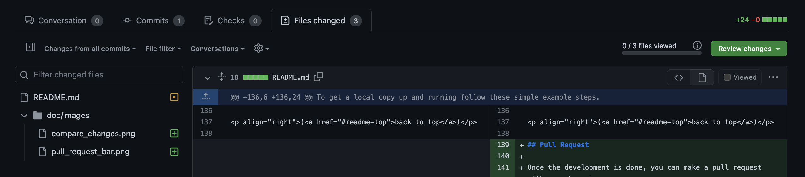

<a name="readme-top"></a>

<!-- [![Contributors][contributors-shield]][contributors-url]
[![Forks][forks-shield]][forks-url]
[![Stargazers][stars-shield]][stars-url]
[![Issues][issues-shield]][issues-url]
[![MIT License][license-shield]][license-url]

<!-- PROJECT LOGO -->
<br />
<div align="center">
  <a href="https://github.com/redxouls/Echo">
    <!--  -->
  </a>

<h1 align="center">Echo</h3>

  <p align="center">
    Explore the dark with sound waves.
    <br />
    <a href="https://github.com/redxouls/Echo"><strong>Explore the docs »</strong></a>
    <br />
    <br />
    <a href="https://github.com/redxouls/Echo">View Demo</a>
    ·
    <a href="https://github.com/redxouls/Echo">Report Bug</a>
    ·
    <a href="https://github.com/redxouls/Echo">Request Feature</a>
  </p>
</div>

<!-- TABLE OF CONTENTS -->
<details>
  <summary>Table of Contents</summary>
  <ol>
    <li>
      <a href="#about-the-project">About The Project</a>
      <ul>
        <li><a href="#built-with">Built With</a></li>
      </ul>
    </li>
    <li>
      <a href="#getting-started">Getting Started</a>
      <ul>
        <li><a href="#prerequisites">Prerequisites</a></li>
        <li><a href="#installation">Installation</a></li>
        <li><a href="#development">Development</a></li>
        <li><a href="#pull-request">Pull Request</a></li>
      </ul>
    </li>
    <li><a href="#usage">Usage</a></li>
    <li><a href="#roadmap">Roadmap</a></li>
    <li><a href="#contributing">Contributing</a></li>
    <li><a href="#license">License</a></li>
    <li><a href="#contact">Contact</a></li>
    <li><a href="#acknowledgments">Acknowledgments</a></li>
  </ol>
</details>

<!-- ABOUT THE PROJECT -->

## About The Project

<!-- [![Product Name Screen Shot][product-screenshot]](https://example.com) -->

This is the introduction of the game "Echo".

<p align="right">(<a href="#readme-top">back to top</a>)</p>

### Built With

- [![Unity][unity.com]][unity-url]

<p align="right">(<a href="#readme-top">back to top</a>)</p>

<!-- GETTING STARTED -->

## Getting Started

To get a local copy up and running follow these simple example steps.

### Prerequisites

- Unity (2021.3.9f1)

### Installation

1.  Clone the repo

    ```sh
    # Use SSH auth (Recommended for development)
    git clone git@github.com:redxouls/Echo.git

    # Default clone
    git clone https://github.com/redxouls/Echo.git
    ```

2.  trigger git-lfs (Install git-lfs at [https://git-lfs.github.com/](https://git-lfs.github.com/))
    ```sh
    cd Echo
    git lfs install
    git lfs pull
    ```

<p align="right">(<a href="#readme-top">back to top</a>)</p>

<!-- USAGE EXAMPLES -->

## Development

1. Create your Feature Branch

   ```sh
   # Make your local main up-to-date
   git checkout main
   git fetch origin
   git rebase origin/main

   # Create and checkout to a new branch with name feature/AmazingFeature
   git checkout -b feature/AmazingFeature
   ```

2. Commit your Changes
   ```
   git commit -m 'Add some AmazingFeature'
   ```
3. Sync your local branch with upstream/main
   ```sh
   git fetch origin
   git rebase origin/main
   ```
4. Push to the Branch
   ```sh
   git push origin feature/AmazingFeature
   ```
5. Open a Pull Request

<p align="right">(<a href="#readme-top">back to top</a>)</p>

## Pull Request

Once the development is done, you can make a pull request with your branch.

**Make a pull request**



1. Click the `Pull request` tab.
2. Click the `New pull request` button.


3. At the `compare branch` dropdown, choose the branch you developed.
4. Review the file changes you made in the branch. After confirming the changes, click `Create pull request`.
5. Change the title of your pull request according to the issue you are dealing with. The tiltle should follow the format `ECHO-#{ISSUE_NUMBER} {ISSUE_NAME}`
6. Briefly describe what you've done and fill out the template for your pull request.

**Merge Pull Request**


1. Go to `Files changed` tab to review the changes.
2. If no conflict the merge button should be green.
   
3. **Click on `Squash and merge`**. and change the commit message to be as same as the title of this PR. The commit message should follow the format `ECHO-#{ISSUE_NUMBER} {ISSUE_NAME}`.
4. If the green `merge` button is not available, the conflict error is shown on the website. You should go back to your branch and fix the conflict first. You should `git fetch` and `git rebase origin\main`.

## Usage

Use this space to show useful examples of how a project can be used. Additional screenshots, code examples and demos work well in this space. You may also link to more resources.

_For more examples, please refer to the [Documentation](https://example.com)_

<p align="right">(<a href="#readme-top">back to top</a>)</p>

<!-- ROADMAP -->

## Roadmap

- [ ] Feature 1
- [ ] Feature 2
- [ ] Feature 3
  - [ ] Nested Feature

See the [open issues](https://github.com/redxouls/Echo/issues) for a full list of proposed features (and known issues).

<p align="right">(<a href="#readme-top">back to top</a>)</p>

<!-- CONTRIBUTING -->

## Contributing

Contributions are what make the open source community such an amazing place to learn, inspire, and create. Any contributions you make are **greatly appreciated**.

If you have a suggestion that would make this better, please fork the repo and create a pull request. You can also simply open an issue with the tag "enhancement".
Don't forget to give the project a star! Thanks again!

1. Fork the Project
2. Create your Feature Branch (`git checkout -b feature/AmazingFeature`)
3. Commit your Changes (`git commit -m 'Add some AmazingFeature'`)
4. Push to the Branch (`git push origin feature/AmazingFeature`)
5. Open a Pull Request

<p align="right">(<a href="#readme-top">back to top</a>)</p>

<!-- LICENSE -->

## License

Distributed under the MIT License. See `LICENSE.txt` for more information.

<p align="right">(<a href="#readme-top">back to top</a>)</p>

<!-- CONTACT -->

## Contact

<!-- Your Name - [@twitter_handle](https://twitter.com/twitter_handle) - email@email_client.com -->

Project Link: [https://github.com/redxouls/Echo](https://github.com/redxouls/Echo)

<p align="right">(<a href="#readme-top">back to top</a>)</p>

<!-- ACKNOWLEDGMENTS -->

## Acknowledgments

- []()
- []()
- []()

<p align="right">(<a href="#readme-top">back to top</a>)</p>

<!-- MARKDOWN LINKS & IMAGES -->
<!-- https://www.markdownguide.org/basic-syntax/#reference-style-links -->

<!-- [contributors-shield]: https://img.shields.io/github/contributors/redxouls/Echo.svg?style=for-the-badge -->
<!-- [contributors-url]: https://github.com/redxouls/Echo/graphs/contributors -->

<!-- [forks-shield]: https://img.shields.io/github/forks/redxouls/Echo.svg?style=for-the-badge
[forks-url]: https://github.com/redxouls/Echo/network/members
[stars-shield]: https://img.shields.io/github/stars/redxouls/Echo.svg?style=for-the-badge
[stars-url]: https://github.com/redxouls/Echo/stargazers
[issues-shield]: https://img.shields.io/github/issues/redxouls/Echo.svg?style=for-the-badge
[issues-url]: https://github.com/redxouls/Echo/issues
[license-shield]: https://img.shields.io/github/license/redxouls/Echo.svg?style=for-the-badge
[license-url]: https://github.com/redxouls/Echo/blob/master/LICENSE.txt -->

[product-screenshot]: images/screenshot.png
[unity.com]: https://img.shields.io/badge/unity-%23000000.svg?style=for-the-badge&logo=unity&logoColor=white
[unity-url]: https://unity3d.com
